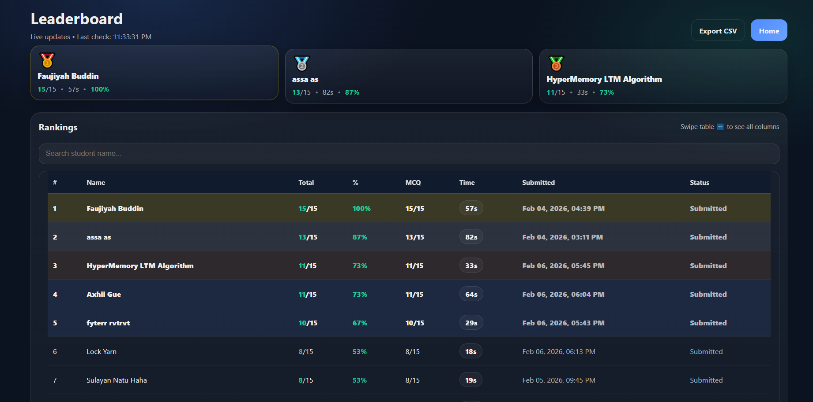
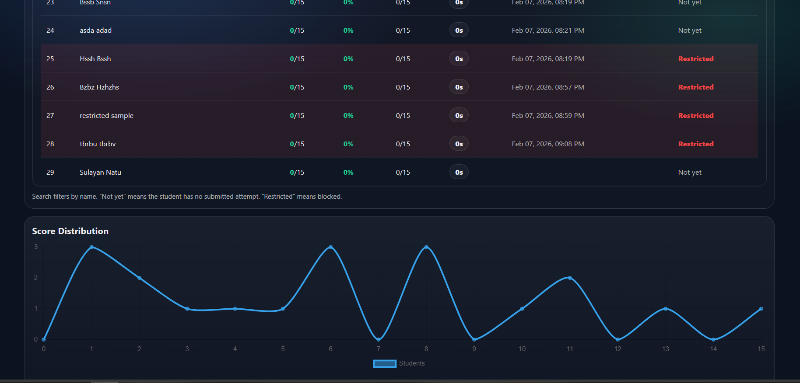
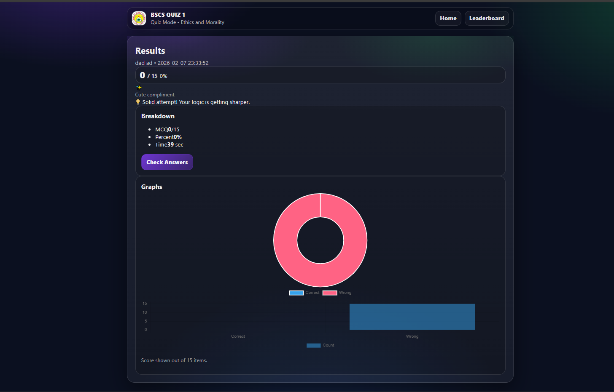
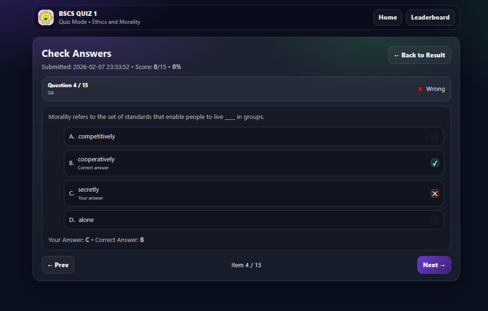

# BASC Quiz System (Practice Project)

A lightweight **practice-only** quiz web app built with **PHP + MariaDB (MySQL)** for running simple classroom quizzes on a local network using **XAMPP**.  
It includes a **live-updating leaderboard**, **score distribution chart**, **CSV export**, and a **review page** to check correct answers after submission.

> ⚠️ **Practice Only:** This project is for learning and school practice. It is **not production-ready** and may lack security hardening needed for public deployment.

---

## Project Overview

This project simulates a real classroom quiz workflow:

1. A student enters their name on the **Home** page.
2. The system creates a **single attempt** for that student.
3. The student takes the timed quiz inside **quiz.php**.
4. When they submit, the system scores the attempt and saves:
   - MCQ score
   - Identification score
   - Total score
   - Time used
   - Submitted status
5. The student can view:
   - **Result page** (final score + summary)
   - **Review page** (their answers vs correct answers)
6. The **Leaderboard** updates live and ranks students using a tie-breaker:
   - Higher score first
   - Faster time wins
7. The app also includes a **Restriction System**:
   - If the student switches tabs too many times, they become **Restricted**
   - Restricted students are blocked from taking the quiz again and are shown as **Restricted** on the leaderboard

This is designed for **local network / classroom** use (XAMPP), where a teacher can quickly run quizzes and export results.

---

## Features

### Quiz Flow
- Student name entry (**session-based**)
- **One attempt only** per student (prevents retakes)
- Supports:
  - Multiple Choice Questions (MCQ)
  - Identification questions (image-based)
- **Timer-based** exam session
- Automatic scoring + time tracking
- Submit flow with result screen

### Restriction System (Anti-cheat Practice)
- **Tab-switch limit** (example: 3 tab switches = restricted)
- When restricted:
  - Redirects to **restricted.php**
  - Plays an optional **error sound**
  - Student cannot attempt again
- Leaderboard shows **Restricted** status (red highlight)

> Note: Client-side restrictions can be bypassed by advanced users. This is intended for practice/classroom only.

### Leaderboard + Analytics
- Live-updating leaderboard (**auto refresh**)
- Tie-breaker ranking (higher score, then faster time)
- Score distribution chart (**Chart.js**)
- **CSV export** (Excel-friendly)

### Review Mode
- `review.php` allows students to review:
  - Their submitted answers
  - The correct answers
  - Correct/Incorrect indicators

Recommended rule:
- Only allow `review.php` if `submitted = 1`.

---

## Tech Stack

- **PHP** (vanilla)
- **MariaDB / MySQL**
- **XAMPP** (Apache + PHP + MariaDB)
- **Chart.js** (score distribution chart)
- HTML / CSS / JavaScript

---

## Screenshots

### Home / Start


### Quiz (Timer + Quiz Session)


### Leaderboard


### Rankings


### Restricted UI


### Restricted Leaderboard


### Result


### Review



## Getting Started Create folder to the htdocs

C:\xampp\htdocs\basc-quiz

## How to run it
Go to the http://localhost/basc-quiz/

### 1 Clone / Download

```bash
git clone https://github.com/buildwithjaym/basc-quiz-system.git
