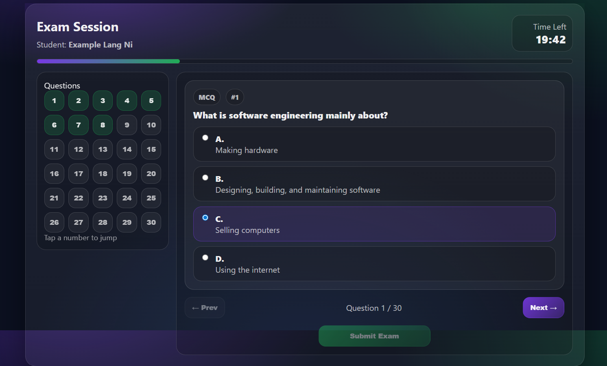
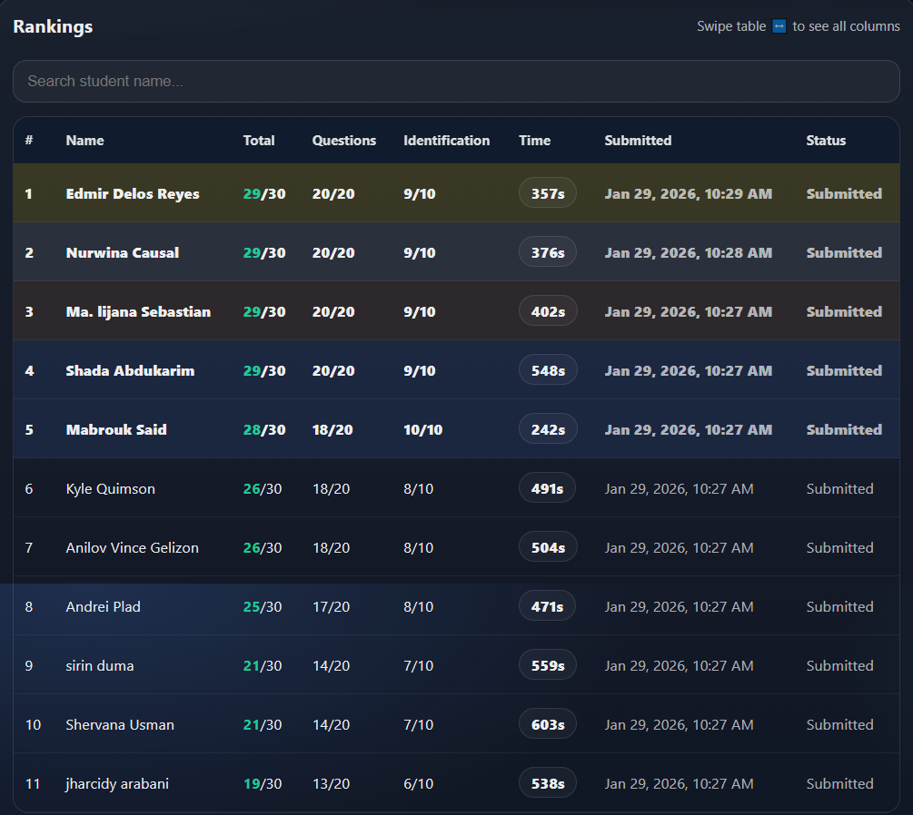

# BASC Quiz System (Practice Project)
Practice-only quiz system for classroom use on XAMPP.”

A lightweight **practice-only** quiz web app built with **PHP + MariaDB (MySQL)** for running simple class quizzes on a local network (XAMPP).  
Includes a **live-updating leaderboard**, score distribution chart, and **CSV export** for teacher submissions.

> ⚠️ **Practice Only:** This project is created for learning and school practice. It is not production-ready and may lack security hardening needed for public deployment.

---

## Features

- Student name entry (session-based)
- One-attempt exam flow (configurable)
- Supports:
  - Multiple Choice Questions (MCQ)
  - Identification questions
- Automatic scoring + time tracking
- Leaderboard (Top 50) with tie-breaker (faster time wins)
- Score distribution chart (Chart.js)
- CSV export (Excel-friendly)
- Mobile-friendly UI with horizontal table scroll

---

## Tech Stack

- **PHP** (vanilla)
- **MariaDB / MySQL**
- **XAMPP** (Apache + PHP + MariaDB)
- **Chart.js** (for score distribution)
- HTML/CSS/JS

---


## Screenshots

### Home / Start


### Quiz_Time


### Leaderboard


### Ranking



## Getting Started (XAMPP)

### 1) Clone / Download

```bash
git clone https://github.com/buildwithjaym>/basc-quiz-system.git
